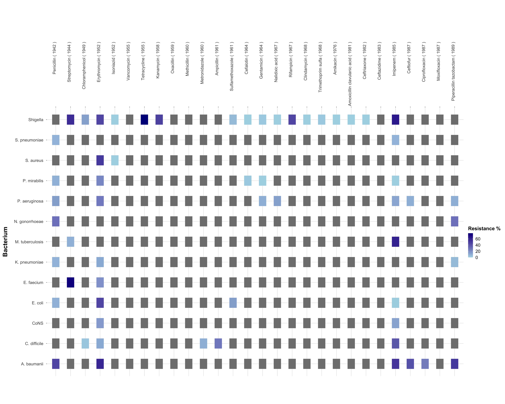

# DataViz_Critique_and_Reconstruction


### Objective and Audience

The objective and audience of the original data visualisation chosen can be summarised as follows: 

**Objective**
The original data visualisation's objective is to provide a comprehensive overview of bacterial resistance to various antibiotics, highlighting the relative effectiveness of individual antibiotics against different bacteria, and emphasising the stagnation in developing new antibiotics over the years.


**Audience**

Given that the original visualisation is published on a visualisation-focused site, the main audience is the general public, especially those interested in understanding antibiotic resistance patterns. The visualisation does reference credible sources like the Centre for Disease Dynamics, World Health Organisation, and CDC. Such platforms typically target a wide demographic, ranging from enthusiasts who appreciate well-crafted data visualisations to individuals simply seeking to understand complex topics in a more accessible manner. 

### Critique

The visualisation chosen had the following three main issues:

##### + Overwhelming Complexity:
Cluttered Display: The visualisation is densely populated with data, labels, and colours, potentially confusing viewers. Inconsistent circle area may mislead viewers. The visualisation must be improved to convey the relative importance due to non-uniform scales.

##### + Perceptual Issues:
The pink and purple choices are problematic for those with certain colour blindness (Red-Blind/Protanopia and Monochromacy/Achromatopsia). Also, scattered small text annotations hinder quick understanding.Varying circle sizes and overlaps misrepresent data. Shading and density variations are not optimised. Different scales for bacteria and antibiotics hinder direct comparisons.

##### + Audience Consideration: 
Excessive detail and data points can obscure the main message for non-specialists. The distinction between individual antibiotics and antibiotic families is unclear. The line indicating "drug ineffective against bacteria" is easily misconstrued as a grid for the plot. 


## Original

<center>Figure 1. Original Visualization. Source: [informationisbeautiful.net](https://informationisbeautiful.net/visualizations/antibiotic-resistance/) (July 2014).</center>

## Reconstruct

<center>Figure 2: Antibiotic Resistance Heatmap (tnathu-ai, Sep 2023).</center>

## Repository Structure

```
.
├── Deconstruct, Reconstruct Web Report.html
├── Deconstruct, Reconstruct Web Report.pdf
├── Deconstruct, Reconstruct Web Report_files
│   └── MathJax.js
├── LICENSE
├── README.md
├── code
│   ├── s3879312 - final.Rmd
│   ├── s3879312---final.docx
│   ├── s3879312---final.html
│   └── s3879312---final.pdf
├── data
│   ├── antibiotic_data.xlsx
│   ├── cleaned_antibiotic_data.csv
│   └── cleaned_data.csv
└── images
    ├── antibiotic_resistance_plot.png
    └── original_image.png
```


## References

* Information Is Beautiful. (n.d.). Antibiotic Resistance. https://informationisbeautiful.net/visualizations/antibiotic-resistance/

* Pneumococcal Disease and Antibiotic Resistance | CDC. (2022, January 24). https://www.cdc.gov/pneumococcal/clinicians/drug-resistance.html

* About Division of Bacterial Diseases | CDC. (2021, November 30). https://www.cdc.gov/ncird/dbd.html

* Immunization and Respiratory Diseases (NCIRD) Home. (2020). https://www.cdc.gov/ncird/

* Antibiotic - New World Encyclopedia. (n.d.). https://www.newworldencyclopedia.org/entry/Antibiotic

* Antibiotics | Society | The Guardian. (n.d.). https://www.theguardian.com/society/antibiotics

* Drug-Resistant Superbugs Sweeping Across Europe - Slashdot. (2011, November 18). https://science.slashdot.org/story/11/11/18/0430245/drug-resistant-superbugs-sweeping-across-europe

* NHS. (2018, August 16). Medicines A-Z. https://www.nhs.uk/medicines/

* Wise, R., Hart, T., Cars, O., Streulens, M., Helmuth, R., Huovinen, P., & Sprenger, M. (1998). Antimicrobial resistance. BMJ, 317(7159), 609–610. https://doi.org/10.1136/bmj.317.7159.609

* World Health Organisation. (2018, February 15). Antimicrobial resistance. https://www.who.int/en/news-room/fact-sheets/detail/antimicrobial-resistance

* Simonsen, G. S. (2018). Antimicrobial resistance surveillance in Europe and beyond. Eurosurveillance, 23(42). https://doi.org/10.2807/1560-7917.es.2018.23.42.1800560

* Rogers, S. (2013, March 11). Antibiotics and drug resistance: how do we compare? The Guardian. https://www.theguardian.com/news/datablog/2013/mar/11/antibiotic-drug-resistance

* Wickham, H. (2010). A Layered Grammar of Graphics. Journal of Computational and Graphical Statistics, 19(1), 3-28. https://doi.org/10.1198/jcgs.2009.07098

* Riederer, Y. X., Dervieux, C., & Emily. (n.d.). Acknowledgments | R Markdown Cookbook. https://bookdown.org/yihui/rmarkdown-cookbook/acknowledgments.html

* Create Elegant Data Visualisations Using the Grammar of Graphics. (2019). https://ggplot2.tidyverse.org/

* Create Elegant Data Visualisations Using the Grammar of Graphics [R package ggplot2 version 3.2.1]. (2019). https://cran.r-project.org/package=ggplot2

## Acknowledgments

* Baglin, J. (2023). Data Visualisation: From Theory to Practice. In Data Visualisation and
Communication (2350) [Online Textbook]. RMIT University. Retrieved from https://dark-star161610.appspot.com/secured/_book/index.html

