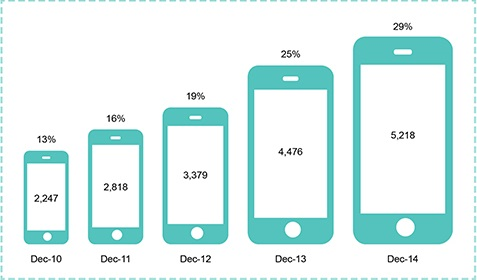

```{r setup, include=FALSE}
# Do not change these settings!
knitr::opts_chunk$set(warning = FALSE, message = FALSE)
```

### Assessment declaration checklist

Please carefully read the statements below and check each box if you agree with the declaration. If you do not check all boxes, your assignment will not be marked. If you make a false declaration on any of these points, you may be investigated for academic misconduct. Students found to have breached academic integrity may receive official warnings and/or serious academic penalties. Please read more about academic integrity [here](https://www.rmit.edu.au/students/student-essentials/assessment-and-exams/academic-integrity). If you are unsure about any of these points or feel your assessment might breach academic integrity, please contact your course coordinator for support. It is important that you DO NOT submit any assessment until you can complete the declaration truthfully. 

**By checking the boxes below, I declare the following:**

- <input type="checkbox" id="dec1" name="dec1" value="Agree"> I have not impersonated, or allowed myself to be impersonated by, any person for the purposes of this assessment 

- <input type="checkbox" id="dec2" name="dec2" value="Agree"> This assessment is my original work and no part of it has been copied from any other source except where due acknowledgement is made.

- <input type="checkbox" id="dec3" name="dec3" value="Agree"> No part of this assessment has been written for me by any other person except where such collaboration has been authorised by the lecturer/teacher concerned.

- <input type="checkbox" id="dec4" name="dec4" value="Agree"> Where this work is being submitted for individual assessment, I declare that it is my original work and that no part has been contributed by, produced by or in conjunction with another student.

- <input type="checkbox" id="dec5" name="dec5" value="Agree"> I give permission for my assessment response to be reproduced, communicated compared and archived for the purposes of detecting plagiarism.

- <input type="checkbox" id="dec6" name="dec6" value="Agree"> I give permission for a copy of my assessment to be retained by the university for review and comparison, including review by external examiners.

**I understand that:**

- <input type="checkbox" id="dec7" name="dec7" value="Agree"> Plagiarism is the presentation of the work, idea or creation of another person as though it is your own. It is a form of cheating and is a very serious academic offence that may lead to exclusion from the University. Plagiarised material can be drawn from, and presented in, written, graphic and visual form, including electronic data and oral presentations. Plagiarism occurs when the origin of the material used is not appropriately cited.

- <input type="checkbox" id="dec8" name="dec8" value="Agree"> Plagiarism includes the act of assisting or allowing another person to plagiarise or to copy my work.

**I agree and acknowledge that:**

- <input type="checkbox" id="dec9" name="dec9" value="Agree"> I have read and understood the Declaration and Statement of Authorship above.

- <input type="checkbox" id="dec10" name="dec10" value="Agree"> If I do not agree to the Declaration and Statement of Authorship in this context and all boxes are not checked, the assessment outcome is not valid for assessment purposes and will not be included in my final result for this course.


**This is a template file. The following example included is not considered a good example to follow for Assignment 2. Remove this warning prior to submitting.** 

## Deconstruct

### Original

The original data visualisation selected for the assignment was as follows:

<br>
<center>

</center>
<center>*Source: ACMA Research and Analysis Section (2015).*</center>
<br>


### Objective and Audience

The objective and audience of the original data visualisation chosen can be summarised as follows: 

**Objective**

**Audience**

### Critique

The visualisation chosen had the following three main issues:

* Briefly explain issue 1
* Briefly explain issue 2
* Briefly explain issue 3

## Reconstruct

### Code

The following code was used to fix the issues identified in the original. 

```{r}
library(ggplot2)
smartphone <- data.frame(Year = c("Dec-10", "Dec-11", 
                                  "Dec-12", "Dec-13", "Dec-14"),
                      Count = c(2247, 2818, 3379, 4476,5218),
                      Perc = c(13, 16, 19, 25,29))

p1 <- ggplot(data = smartphone, aes(group = 1, x = Year,y = Perc))
p1 <- p1 + geom_line(stat = "identity", colour = "turquoise3") + geom_point(colour = "turquoise3") + 
  geom_text(aes(label = paste(Perc,"%",sep="")),nudge_y = -2, nudge_x = .05) +
  labs(
    title = "Australian Mobile-only Phone Users % of Population",
    y = "Population %") + theme_minimal() + scale_y_continuous(limits = c(0,30))
```


### Reconstruction

The following plot fixes the main issues in the original.

```{r fig.align="center", echo = FALSE}
p1
```

## References

The reference to the original data visualisation choose, the data source(s) used for the reconstruction and any other sources used for this assignment are as follows:

* ACMA Research and Analysis Section. (2015). *Australians get mobile*. Retrieved August 13, 2019, from Australian Communications and Media Authority website: https://www.acma.gov.au/theACMA/engage-blogs/engage-blogs/Research-snapshots/Australians-get-mobile