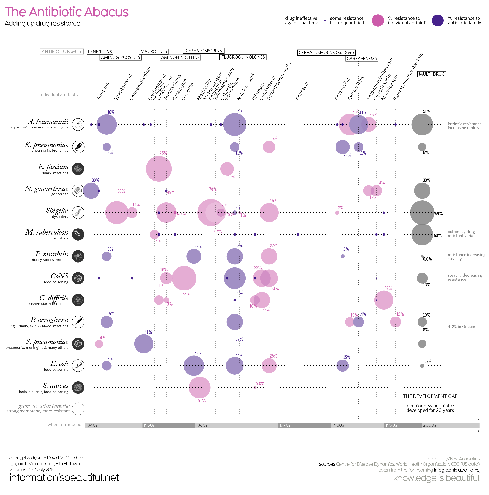

```{r setup, include=FALSE}
# Do not change these settings!
knitr::opts_chunk$set(warning = FALSE, message = FALSE)
```

### Assessment declaration checklist

Please carefully read the statements below and check each box if you agree with the declaration. If you do not check all boxes, your assignment will not be marked. If you make a false declaration on any of these points, you may be investigated for academic misconduct. Students found to have breached academic integrity may receive official warnings and/or serious academic penalties. Please read more about academic integrity [here](https://www.rmit.edu.au/students/student-essentials/assessment-and-exams/academic-integrity). If you are unsure about any of these points or feel your assessment might breach academic integrity, please contact your course coordinator for support. It is important that you DO NOT submit any assessment until you can complete the declaration truthfully. 

**By checking the boxes below, I declare the following:**

- <input type="checkbox" id="dec1" name="dec1" value="Agree"> I have not impersonated, or allowed myself to be impersonated by, any person for the purposes of this assessment 

- <input type="checkbox" id="dec2" name="dec2" value="Agree"> This assessment is my original work and no part of it has been copied from any other source except where due acknowledgement is made.

- <input type="checkbox" id="dec3" name="dec3" value="Agree"> No part of this assessment has been written for me by any other person except where such collaboration has been authorised by the lecturer/teacher concerned.

- <input type="checkbox" id="dec4" name="dec4" value="Agree"> Where this work is being submitted for individual assessment, I declare that it is my original work and that no part has been contributed by, produced by or in conjunction with another student.

- <input type="checkbox" id="dec5" name="dec5" value="Agree"> I give permission for my assessment response to be reproduced, communicated compared and archived for the purposes of detecting plagiarism.

- <input type="checkbox" id="dec6" name="dec6" value="Agree"> I give permission for a copy of my assessment to be retained by the university for review and comparison, including review by external examiners.

**I understand that:**

- <input type="checkbox" id="dec7" name="dec7" value="Agree"> Plagiarism is the presentation of the work, idea or creation of another person as though it is your own. It is a form of cheating and is a very serious academic offence that may lead to exclusion from the University. Plagiarised material can be drawn from, and presented in, written, graphic and visual form, including electronic data and oral presentations. Plagiarism occurs when the origin of the material used is not appropriately cited.

- <input type="checkbox" id="dec8" name="dec8" value="Agree"> Plagiarism includes the act of assisting or allowing another person to plagiarise or to copy my work.

**I agree and acknowledge that:**

- <input type="checkbox" id="dec9" name="dec9" value="Agree"> I have read and understood the Declaration and Statement of Authorship above.

- <input type="checkbox" id="dec10" name="dec10" value="Agree"> If I do not agree to the Declaration and Statement of Authorship in this context and all boxes are not checked, the assessment outcome is not valid for assessment purposes and will not be included in my final result for this course.


# Antibiotic Resistance: A Comprehensive Analysis 

## Statement of Purpose
The aim of this study is two-fold:
1. To provide an effective visualization that educates the general public about the dangers of excessive antibiotic use.
2. To offer infectious disease doctors a quick yet comprehensive overview of antibiotic resistance in commonly encountered bacteria.

## Table of Contents
1. [Introduction](#introduction)
2. [Columns Explained](#columns-explained)
3. [Key Highlights](#key-highlights)
4. [Key Concerns](#key-concerns)
5. [Conclusion](#conclusion)
6. [References](#references)

---

## Introduction
The following report aims to provide a detailed understanding of a dataset concerning antibiotic resistance across various bacterial species. This topic is of growing concern in the medical and scientific community. 

---

## Columns Explained

| Column                    | Description                                                                 |
|---------------------------|-----------------------------------------------------------------------------|
| Bacterium Name            | Scientific name of the bacteria.                                             |
| Causes                    | Diseases or conditions that the bacteria typically cause.                    |
| Gram-negative?            | Indicates whether the bacterium is Gram-negative ('yes' or 'no').            |
| Individual Drugs          | Resistance levels to specific antibiotics, represented as percentages.       |
| Remarks                   | Additional comments about antibiotic resistance.                             |
| Resistance Score          | A scale from 1-4 indicating the level of concern, with higher scores being more concerning. |
| N Antibiotics or Classes  | Number of antibiotics or classes showing at least some resistance.           |
| Average % Resistance      | Calculated average resistance score across all considered antibiotics.       |

---

## Key Highlights

### Bacterial Species of Concern

1. **A. baumanii**
    - Nicknamed "Iraqibacter"
    - High resistance to multiple antibiotics
    - Resistance score: 4

2. **E. faecium**
    - 75% resistance to a specific antibiotic
    - Average resistance: 47%

3. **N. gonorrhoeae**
    - Causes gonorrhea
    - Resistance score: 3
    - 14.35% average resistance

4. **M. tuberculosis**
    - Extremely drug-resistant variants
    - Resistance score: 3

5. **S. aureus**
    - 25.90% average resistance but to only one antibiotic class

6. **Note After 1992**
    - No major new antibiotics have been developed for over 20 years.

7. **Gram-negative Bacteria**
    - Typically more resistant due to their cell wall structure.

---

## Key Concerns

1. **Rising Resistance**: Resistance is stable or increasing for many bacteria.
2. **Multi-drug Resistance**: Resistance to multiple classes of antibiotics.
3. **Gram-negative Bacteria**: More resistant and increasing so over time.
4. **Data Gaps**: Unquantified resistances could underrepresent actual resistance levels.

---

## Conclusion

This dataset serves as a snapshot that underlines the urgency for new antibiotics and effective strategies to manage antibiotic resistance. It calls for immediate action from both the medical community and policymakers.

---


## Deconstruct

### Original

The original data visualisation selected for the assignment was as follows:

<br>
<center>

</center>
<center>*Figure 1. Original Visualization. Source: [informationisbeautiful.net](https://informationisbeautiful.net/visualizations/antibiotic-resistance/) (July 2014).*</center>
<br>


### Objective and Audience

The objective and audience of the original data visualisation chosen can be summarised as follows: 

**Objective**

**Audience**

### Critique

The visualisation chosen had the following three main issues:

* hard for common audience with no medical background to identify issues
* \Color blindness issues
*  Preattentive Processing - Shapes and sizes of the circle is not unified (area is not obvious and overlapping on the grid), light/dark, use density mislead, Area
(highlight timeline: no development new antibiotics for 20 years and the resistance of existing antibiotics)
not compare on the same scale
No major visually saying that no major new antibiotics develop in 20 years

Changes in new visualization:
+ Gestalt Laws: proximity (cluster together so a group?), similarity -> corrrect using symmetry to compare side by side, auto interpreted as the foreground (Figure Ground Principle)
+ Use Length to represent position - common scale - same scale but unaligned for 2 cat
+ Color - Hue (different color viz for nominal variables)
+ Use dodge method to have position adjustment. Other methods (filling, jiterring, nudging, stacking)
+ Faceting
+ Coordinate systems: Cartesian
```
data and aesthetic mappings,
• geometric objects,
• scales, and
• facet specification.
We have also touched on two other components:
• statistical transformations, and
• the coordinate system.
```

## Reconstruct

### Code

The following code was used to fix the issues identified in the original. 

```{r import}
# Read and preprocess libraries
library(readxl)
library(dplyr)
library(stringr)
library(writexl)

# Load necessary libraries
library(ggplot2)
library(tidyr)

```

### Pre-processing

**Data:** In July 2014, the dataset on antibiotic resistance was sourced from [informationisbeautiful.net](https://docs.google.com/spreadsheets/d/1QMSQDr0vx_NuMkbSb-9wjUCBplMZpYvxASTJh1M-NhI/edit#gid=0). I have independently verified the integrity and accuracy of this data in 2023 against original sources, including the Centre for Disease Dynamics, World Health Organisation, and CDC (US data). Subsequent data processing and formatting to generate a tailored dataframe were conducted using the R programming language.

```{r}
# Data
antibiotic_resistance_df <- data.frame(
  Bacterium_name = c('A. baumanii', 'K. pneumoniae', 'E. faecium', 'N. gonorrhoeae', 'Shigella', 
                     'M. tuberculosis', 'P. mirabilis', 'CoNS', 'C. difficile', 
                     'P. aeruginosa', 'S. pneumoniae', 'E. coli', 'S. aureus'),
  
  Causes = c('pneumonia, meningitis', 'pneumonia, bronchitis, urinary infections', 'urinary infections',
             'gonorrhoea', 'dysentry', 'tuberculosis', 'kidney stones, proteus', 'food poisoning',
             'severe diarrhoea, colitis', 'lung, urinary, skin, wound & blood infections', 
             'pneumonia, meningitis & many other infections', 'food poisoning', 'boils, sinusitis, food poisoning'),
  
  Gram_negative = c('yes', 'yes', 'no', 'yes', 'yes', 'no', 'yes', 'no', 'no', 'yes', 'no', 'yes', 'no'),

  Penicillin = c(46, 8, NA, 30, NA, NA, 9, NA, NA, 15, 8, 9, NA),
  Streptomycin = c(NA, NA, 75, NA, 56, 9, NA, NA, NA, NA, NA, NA, NA),
  Chloramphenicol = c(NA, NA, NA, NA, 14, NA, NA, NA, 3, NA, NA, NA, NA),
  Erythromycin = c(58, 11, 19, NA, 45, NA, 22, 16, 11, 27, NA, 45, 51),
  Isoniazid = c(NA, NA, NA, NA, 0.9, NA, NA, NA, NA, NA, NA, NA, 0.8),
  Vancomycin = c(NA, NA, NA, NA, NA, NA, NA, NA, NA, NA, NA, NA, NA),
  Tetracycline = c(NA, NA, NA, NA, 78, NA, NA, NA, NA, NA, NA, NA, NA),
  Kanamycin = c(NA, NA, NA, NA, 47, NA, NA, NA, NA, NA, NA, NA, NA),
  Oxacillin = c(NA, NA, NA, NA, NA, NA, NA, NA, NA, NA, NA, NA, NA),
  Methicillin = c(NA, NA, NA, NA, NA, NA, NA, NA, NA, NA, NA, NA, NA),
  Metronidazole = c(NA, NA, NA, NA, NA, NA, NA, NA, 10, NA, NA, NA, NA),
  Ampicillin = c(NA, NA, NA, NA, NA, NA, NA, NA, 28, NA, NA, NA, NA),
  Sulfamethoxazole = c(NA, NA, NA, NA, 6, NA, NA, NA, NA, NA, NA, 15, NA),
  Cefalotin = c(NA, NA, NA, NA, 0.2, NA, 2, NA, NA, NA, NA, NA, NA),
  Gentamicin = c(NA, NA, NA, NA, 2, NA, 1, NA, NA, 10, NA, NA, NA),
  Nalidixic_acid = c(NA, NA, NA, NA, 1, NA, NA, NA, NA, 14, NA, NA, NA),
  Rifampicin = c(NA, NA, NA, NA, 46, NA, NA, NA, NA, NA, NA, NA, NA),
  Clindamycin = c(NA, NA, NA, NA, 0.06, NA, NA, NA, NA, NA, NA, NA, NA),
  Trimethoprim_sulfa = c(NA, NA, NA, NA, 2, NA, NA, NA, NA, NA, NA, NA, NA),
  Amikacin = c(NA, NA, NA, NA, 0, NA, NA, NA, NA, NA, NA, NA, NA),
  Amoxicillin_clavulanic_acid = c(NA, NA, NA, NA, 0.06, NA, NA, NA, NA, NA, NA, NA, NA),
  Ceftriaxone = c(NA, NA, NA, NA, 0.06, NA, NA, NA, NA, NA, NA, NA, NA),
  Ceftazidime = c(NA, NA, NA, NA, NA, NA, NA, NA, NA, NA, NA, NA, NA),
  Imipenem = c(52, NA, NA, NA, 64, 60, 0.6, 13, 39, 12, 8, 1.5, NA),
  Ceftiofur = c(41, NA, NA, NA, NA, NA, NA, NA, NA, 10, NA, NA, NA),
  Ciprofloxacin = c(25, NA, NA, NA, NA, NA, NA, NA, NA, NA, NA, NA, NA),
  Moxifloxacin = c(NA, NA, NA, NA, NA, NA, NA, NA, NA, NA, NA, NA, NA),
  Piperacillin_tazobactam = c(51, 6, NA, 30, NA, NA, NA, NA, NA, 10, NA, NA, NA)
)

# Antibiotic Introduction Dates
antibiotic_intro_dates <- data.frame(
  Antibiotic = c('Penicillin', 'Streptomycin', 'Chloramphenicol', 'Erythromycin', 'Isoniazid', 
                 'Vancomycin', 'Tetracycline', 'Kanamycin', 'Oxacillin', 'Methicillin', 'Metronidazole', 
                 'Ampicillin', 'Sulfamethoxazole', 'Cefalotin', 'Gentamicin', 'Nalidixic_acid', 
                 'Rifampicin', 'Clindamycin', 'Trimethoprim_sulfa', 'Amikacin', 'Amoxicillin_clavulanic_acid', 
                 'Ceftriaxone', 'Ceftazidime', 'Imipenem', 'Ceftiofur', 'Ciprofloxacin', 'Moxifloxacin', 
                 'Piperacillin_tazobactam'),
  
  Date_introduced = c(1942, 1944, 1949, 1952, 1952, 1955, 1955, 1958, 1959, 1960, 1960, 1961, 1961, 1964, 
                      1964, 1967, 1967, 1968, 1968, 1976, 1981, 1982, 1983, 1985, 1987, 1987, 1987, 1989)
)

# View the dataframes
head(antibiotic_resistance_df)
head(antibiotic_intro_dates)
```


### Reconstruction

The following plot fixes the main issues in the original.

This heatmap provides a quick visual representation of resistance percentages for various bacteria against different antibiotics. The darker the color, the higher the resistance. The antibiotics are also ordered based on their introduction dates, which can give an idea about the evolution of resistance over time.

```{r, fig.width=25, fig.height=20, fig.align="center", echo = FALSE}
library(ggplot2)
library(reshape2)
library(RColorBrewer)
library(grid)

# Melt the data frame to long format for ggplot
melted_df <- melt(antibiotic_resistance_df, id.vars = c("Bacterium_name", "Causes", "Gram_negative"))

# Ensure that the introduction dates are unique
antibiotic_intro_dates <- antibiotic_intro_dates[!duplicated(antibiotic_intro_dates$Antibiotic),]

# Create an ordered factor for the Antibiotic based on Date_introduced
antibiotic_intro_dates$Antibiotic <- factor(antibiotic_intro_dates$Antibiotic, 
                                           levels = antibiotic_intro_dates$Antibiotic[order(antibiotic_intro_dates$Date_introduced)])

# Merge the melted dataframe with the antibiotic introduction date
melted_df <- merge(melted_df, antibiotic_intro_dates, by.x = "variable", by.y = "Antibiotic", all.x = TRUE)

# Append introduction date to antibiotic name and remove underscores
melted_df$display_name <- paste(gsub("_", " ", melted_df$variable), "(", melted_df$Date_introduced, ")")

# Ensure that display_name is a factor and ordered based on variable
melted_df$display_name <- factor(melted_df$display_name, levels = unique(melted_df$display_name[order(melted_df$variable)]))

library(ggplot2)
library(reshape2)
library(RColorBrewer)
library(grid)

# ... [unchanged code above]

# Plotting the heatmap
p <- ggplot(melted_df, aes(x = display_name, y = Bacterium_name)) +
  geom_tile(aes(fill = value), color = "white", width = 0.7, height = 0.7) +
  scale_fill_gradient(low = "lightblue", high = "darkblue", name = "Resistance %") +
  labs(x = "Individual Antibiotic", y = "Bacterium") +
  theme(
        axis.text.x = element_text(angle = 90, hjust = 1, size = 12, margin = margin(t = 10)),  # Extra space between x-axis values
        axis.text.y = element_text(size = 12, margin = margin(r = 10)),  # Extra space between y-axis values
        axis.title.x = element_text(face = "bold", size = 20, margin = margin(t = 20)),  # Padding between x-axis title and values
        axis.title.y = element_text(face = "bold", size = 20, margin = margin(r = 20)),  # Padding between y-axis title and values
        plot.margin = margin(150, 10, 100, 10),  # Adjusted margins
        panel.grid.major = element_line(colour = "gray", size = 0.25),
        plot.background = element_rect(fill = "white", color = NA),
        panel.background = element_rect(fill = "white", color = NA),
        legend.text = element_text(size = 14),          # Increase legend text size
        legend.title = element_text(size = 16, face = "bold")  # Increase legend title size
  ) + 
  scale_x_discrete(position = "top")


# Display plot
print(p)

# Display the title text at the top-left of the plot
grid::grid.text("ANTIBIOTIC CHALLENGE: BACTERIAL RESISTANCE OVERVIEW", x = 0.01, y = 0.975, just = c("left", "top"), gp = grid::gpar(col = "blue", fontsize = 30, fontface = "bold"))

# Display the main source text below the plot
grid::grid.text("Sources: Centre for Disease Dynamics, World Health Organisation, CDC (US data) | Designed by Thu Tran", x = 0.01, y = 0.02, just = c("left", "bottom"), gp = grid::gpar(col = "gray", fontsize = 13, fontface = "italic"))

# Display the additional information below the main source text
grid::grid.text("Original image: informationisbeautiful.net | Data collected by July 2014", x = 0.01, y = 0.01, just = c("left", "bottom"), gp = grid::gpar(col = "gray", fontsize = 13, fontface = "italic"))

# Save the plot to a file
ggsave(filename = "../images/antibiotic_resistance_plot.png", width = 25, height = 20)

```


```{r, fig.width=25, fig.height=20, fig.align="center", echo = FALSE}
library(ggplot2)
library(reshape2)
library(RColorBrewer)
library(grid)

# Melt the data frame to long format for ggplot
melted_df <- melt(antibiotic_resistance_df, id.vars = c("Bacterium_name", "Causes", "Gram_negative"))

# Ensure that the introduction dates are unique
antibiotic_intro_dates <- antibiotic_intro_dates[!duplicated(antibiotic_intro_dates$Antibiotic),]

# Create an ordered factor for the Antibiotic based on Date_introduced
antibiotic_intro_dates$Antibiotic <- factor(antibiotic_intro_dates$Antibiotic, 
                                           levels = antibiotic_intro_dates$Antibiotic[order(antibiotic_intro_dates$Date_introduced)])

# Merge the melted dataframe with the antibiotic introduction date
melted_df <- merge(melted_df, antibiotic_intro_dates, by.x = "variable", by.y = "Antibiotic", all.x = TRUE)

# Append introduction date to antibiotic name and remove underscores
melted_df$display_name <- paste(gsub("_", " ", melted_df$variable), "(", melted_df$Date_introduced, ")")

# Ensure that display_name is a factor and ordered based on variable
melted_df$display_name <- factor(melted_df$display_name, levels = unique(melted_df$display_name[order(melted_df$variable)]))

# Plotting the heatmap
p <- ggplot(melted_df, aes(x = display_name, y = Bacterium_name)) +
  geom_tile(aes(fill = value), color = "white", width = 0.7, height = 0.7) +
  scale_fill_gradient(low = "lightblue", high = "darkblue", name = "Resistance %") +
  labs(x = "Individual Antibiotic", y = "Bacterium") +
  theme(
        axis.text.x = element_text(angle = 90, hjust = 1, size = 12, margin = margin(t = 10)),  # Extra space between x-axis values
        axis.text.y = element_text(size = 12, margin = margin(r = 10)),  # Extra space between y-axis values
        axis.title.x = element_text(face = "bold", size = 20, margin = margin(t = 20)),  # Padding between x-axis title and values
        axis.title.y = element_text(face = "bold", size = 20, margin = margin(r = 20)),  # Padding between y-axis title and values
        plot.margin = margin(120, 10, 80, 10),  # Increased top margin
        panel.grid.major = element_line(colour = "gray", size = 0.25),
        plot.background = element_rect(fill = "white", color = NA),
        panel.background = element_rect(fill = "white", color = NA)
  ) + 
  scale_x_discrete(position = "top")

# Display plot
print(p)

# Display the title text at the top-left of the plot
grid::grid.text("ANTIBIOTIC CHALLENGE: BACTERIAL RESISTANCE OVERVIEW", x = 0.01, y = 0.975, just = c("left", "top"), gp = grid::gpar(col = "blue", fontsize = 30, fontface = "bold"))

# Display the main source text below the plot
grid::grid.text("Sources: Centre for Disease Dynamics, World Health Organisation, CDC (US data) | Designed by Thu Tran", x = 0.01, y = 0.02, just = c("left", "bottom"), gp = grid::gpar(col = "gray", fontsize = 13, fontface = "italic"))

# Display the additional information below the main source text
grid::grid.text("Original image: informationisbeautiful.net | Data collected by July 2014", x = 0.01, y = 0.01, just = c("left", "bottom"), gp = grid::gpar(col = "gray", fontsize = 13, fontface = "italic"))

# Save the plot
ggsave("../images/antibiotic_resistance_plot.png", width = 25, height = 20)
```


```{r, fig.width=25, fig.height=20}
library(ggplot2)
library(reshape2)
library(RColorBrewer)
library(grid)

# Melt the data frame to long format for ggplot
melted_df <- melt(antibiotic_resistance_df, id.vars = c("Bacterium_name", "Causes", "Gram_negative"))

# Ensure that the introduction dates are unique
antibiotic_intro_dates <- antibiotic_intro_dates[!duplicated(antibiotic_intro_dates$Antibiotic),]

# Create an ordered factor for the Antibiotic based on Date_introduced
antibiotic_intro_dates$Antibiotic <- factor(antibiotic_intro_dates$Antibiotic, 
                                           levels = antibiotic_intro_dates$Antibiotic[order(antibiotic_intro_dates$Date_introduced)])

# Merge the melted dataframe with the antibiotic introduction date
melted_df <- merge(melted_df, antibiotic_intro_dates, by.x = "variable", by.y = "Antibiotic", all.x = TRUE)

# Append introduction date to antibiotic name and remove underscores
melted_df$display_name <- paste(gsub("_", " ", melted_df$variable), "(", melted_df$Date_introduced, ")")

# Ensure that display_name is a factor and ordered based on variable
melted_df$display_name <- factor(melted_df$display_name, levels = unique(melted_df$display_name[order(melted_df$variable)]))

# Plotting the heatmap
p <- ggplot(melted_df, aes(x = display_name, y = Bacterium_name)) +
  geom_tile(aes(fill = value), color = "white", width = 0.7, height = 0.7) +
  scale_fill_gradient(low = "lightblue", high = "darkblue", name = "Resistance %") +
  labs(x = "Individual Antibiotic", y = "Bacterium") +
  theme(
        axis.text.x = element_text(angle = 90, hjust = 1, size = 12, margin = margin(t = 15)),  # Extra space between x-axis title and values
        axis.text.y = element_text(size = 12, margin = margin(r = 10)),  # Extra space between y-axis title and values
        axis.title.x = element_text(face = "bold", size = 14),
        axis.title.y = element_text(face = "bold", size = 14),
        plot.margin = margin(120, 10, 80, 10),  # Increased top margin
        panel.grid.major = element_line(colour = "gray", size = 0.25),
        plot.background = element_rect(fill = "white", color = NA),
        panel.background = element_rect(fill = "white", color = NA)
  ) + 
  scale_x_discrete(position = "top")

# Display plot
print(p)

# Display the title text at the top-left of the plot
grid::grid.text("ANTIBIOTIC CHALLENGE: BACTERIAL RESISTANCE OVERVIEW", x = 0.01, y = 0.970, just = c("left", "top"), gp = grid::gpar(col = "blue", fontsize = 30, fontface = "bold"))

# Display the main source text below the plot
grid::grid.text("Sources: Centre for Disease Dynamics, World Health Organisation, CDC (US data) | Designed by Thu Tran", x = 0.01, y = 0.02, just = c("left", "bottom"), gp = grid::gpar(col = "gray", fontsize = 13, fontface = "italic"))

# Display the additional information below the main source text
grid::grid.text("Original image: informationisbeautiful.net | Data collected by July 2014", x = 0.01, y = 0.01, just = c("left", "bottom"), gp = grid::gpar(col = "gray", fontsize = 13, fontface = "italic"))
```


```{r, fig.width=25, fig.height=20}
library(ggplot2)
library(reshape2)
library(RColorBrewer)
library(grid)

# Melt the data frame to long format for ggplot
melted_df <- melt(antibiotic_resistance_df, id.vars = c("Bacterium_name", "Causes", "Gram_negative"))

# Ensure that the introduction dates are unique
antibiotic_intro_dates <- antibiotic_intro_dates[!duplicated(antibiotic_intro_dates$Antibiotic),]

# Create an ordered factor for the Antibiotic based on Date_introduced
antibiotic_intro_dates$Antibiotic <- factor(antibiotic_intro_dates$Antibiotic, 
                                           levels = antibiotic_intro_dates$Antibiotic[order(antibiotic_intro_dates$Date_introduced)])

# Merge the melted dataframe with the antibiotic introduction date
melted_df <- merge(melted_df, antibiotic_intro_dates, by.x = "variable", by.y = "Antibiotic", all.x = TRUE)

# Append introduction date to antibiotic name and remove underscores
melted_df$display_name <- paste(gsub("_", " ", melted_df$variable), "(", melted_df$Date_introduced, ")")

# Ensure that display_name is a factor and ordered based on variable
melted_df$display_name <- factor(melted_df$display_name, levels = unique(melted_df$display_name[order(melted_df$variable)]))

# Plotting the heatmap
p <- ggplot(melted_df, aes(x = display_name, y = Bacterium_name)) +
  geom_tile(aes(fill = value), color = "white", width = 0.7, height = 0.7) +
  scale_fill_gradient(low = "lightblue", high = "darkblue", name = "Resistance %") +
  labs(x = "Individual Antibiotic", y = "Bacterium") +
  theme(
        axis.text.x = element_text(angle = 90, hjust = 1, size = 12, margin = margin(t = 10)),  # Extra space between x-axis title and values
        axis.text.y = element_text(size = 12, margin = margin(r = 10)),  # Extra space between y-axis title and values
        axis.title.x = element_text(face = "bold", size = 14),
        axis.title.y = element_text(face = "bold", size = 14),
        plot.margin = margin(10, 10, 80, 10),
        panel.grid.major = element_line(colour = "gray", size = 0.25),
        plot.background = element_rect(fill = "white", color = NA),
        panel.background = element_rect(fill = "white", color = NA)
  ) + 
  scale_x_discrete(position = "top")

# Display plot
print(p)

# Display the title text at the top-left of the plot
grid::grid.text("ANTIBIOTIC CHALLENGE: BACTERIAL RESISTANCE OVERVIEW", x = 0.01, y = 0.99, just = c("left", "top"), gp = grid::gpar(col = "blue", fontsize = 20, fontface = "bold"))

# Display the main source text below the plot
grid::grid.text("Sources: Centre for Disease Dynamics, World Health Organisation, CDC (US data) | Designed by Thu Tran", x = 0.01, y = 0.02, just = c("left", "bottom"), gp = grid::gpar(col = "gray", fontsize = 10, fontface = "italic"))

# Display the additional information below the main source text
grid::grid.text("Original image: informationisbeautiful.net | Data collected by July 2014", x = 0.01, y = 0.01, just = c("left", "bottom"), gp = grid::gpar(col = "gray", fontsize = 10, fontface = "italic"))
```


```{r, fig.width=25, fig.height=20}
library(ggplot2)
library(reshape2)
library(RColorBrewer)
library(grid)

# Melt the data frame to long format for ggplot
melted_df <- melt(antibiotic_resistance_df, id.vars = c("Bacterium_name", "Causes", "Gram_negative"))

# Ensure that the introduction dates are unique
antibiotic_intro_dates <- antibiotic_intro_dates[!duplicated(antibiotic_intro_dates$Antibiotic),]

# Create an ordered factor for the Antibiotic based on Date_introduced
antibiotic_intro_dates$Antibiotic <- factor(antibiotic_intro_dates$Antibiotic, 
                                           levels = antibiotic_intro_dates$Antibiotic[order(antibiotic_intro_dates$Date_introduced)])

# Merge the melted dataframe with the antibiotic introduction date
melted_df <- merge(melted_df, antibiotic_intro_dates, by.x = "variable", by.y = "Antibiotic", all.x = TRUE)

# Append introduction date to antibiotic name and remove underscores
melted_df$display_name <- paste(gsub("_", " ", melted_df$variable), "(", melted_df$Date_introduced, ")")

# Ensure that display_name is a factor and ordered based on variable
melted_df$display_name <- factor(melted_df$display_name, levels = unique(melted_df$display_name[order(melted_df$variable)]))

# Plotting the heatmap
p <- ggplot(melted_df, aes(x = display_name, y = Bacterium_name)) +
  geom_tile(aes(fill = value), color = "white", width = 0.7, height = 0.7) +
  scale_fill_gradient(low = "lightblue", high = "darkblue", name = "Resistance %") +
  labs(x = "Individual Antibiotics", y = "Bacterium") +
  theme(
        axis.text.x = element_text(angle = 90, hjust = 1, size = 12, margin = margin(t = 10)),  # Extra space between x-axis title and values
        axis.text.y = element_text(size = 12, margin = margin(r = 10)),  # Extra space between y-axis title and values
        axis.title.x = element_text(face = "bold", size = 14),
        axis.title.y = element_text(face = "bold", size = 14),
        plot.title = element_text(face = "bold", color = "blue", size = 18),  # Even bolder and larger plot title
        plot.margin = margin(10, 10, 80, 10),
        panel.grid.major = element_line(colour = "gray", size = 0.25),
        plot.background = element_rect(fill = "white", color = NA),
        panel.background = element_rect(fill = "white", color = NA)
  ) + 
  scale_x_discrete(position = "top") +
  ggtitle("ANTIBIOTIC CHALLENGE: BACTERIAL RESISTANCE OVERVIEW")

# Display plot
print(p)

# Display the main source text below the plot
grid::grid.text("Sources: Centre for Disease Dynamics, World Health Organisation, CDC (US data) | Designed by Thu Tran (tnathu-ai)", x = 0.01, y = 0.02, just = c("left", "bottom"), gp = grid::gpar(col = "gray", fontsize = 10, fontface = "italic"))

# Display the additional information below the main source text
grid::grid.text("Original image: informationisbeautiful.net | Data collected by July 2014", x = 0.01, y = 0.01, just = c("left", "bottom"), gp = grid::gpar(col = "gray", fontsize = 10, fontface = "italic"))
```


```{r, fig.width=25, fig.height=20}
library(ggplot2)
library(reshape2)
library(RColorBrewer)
library(grid)

# Melt the data frame to long format for ggplot
melted_df <- melt(antibiotic_resistance_df, id.vars = c("Bacterium_name", "Causes", "Gram_negative"))

# Ensure that the introduction dates are unique
antibiotic_intro_dates <- antibiotic_intro_dates[!duplicated(antibiotic_intro_dates$Antibiotic),]

# Create an ordered factor for the Antibiotic based on Date_introduced
antibiotic_intro_dates$Antibiotic <- factor(antibiotic_intro_dates$Antibiotic, 
                                           levels = antibiotic_intro_dates$Antibiotic[order(antibiotic_intro_dates$Date_introduced)])

# Merge the melted dataframe with the antibiotic introduction date
melted_df <- merge(melted_df, antibiotic_intro_dates, by.x = "variable", by.y = "Antibiotic", all.x = TRUE)

# Append introduction date to antibiotic name and remove underscores
melted_df$display_name <- paste(gsub("_", " ", melted_df$variable), "(", melted_df$Date_introduced, ")")

# Ensure that display_name is a factor and ordered based on variable
melted_df$display_name <- factor(melted_df$display_name, levels = unique(melted_df$display_name[order(melted_df$variable)]))

# Plotting the heatmap
p <- ggplot(melted_df, aes(x = display_name, y = Bacterium_name)) +
  geom_tile(aes(fill = value), color = "white", width = 0.7, height = 0.7) +
  scale_fill_gradient(low = "lightblue", high = "darkblue", name = "Resistance %") +
  labs(x = "Individual Antibiotics", y = "Bacterium") +
  theme(
        axis.text.x = element_text(angle = 90, hjust = 1, size = 12, margin = margin(t = 10)),  # Extra space between x-axis title and values
        axis.text.y = element_text(size = 12, margin = margin(r = 10)),  # Extra space between y-axis title and values
        axis.title.x = element_text(face = "bold", size = 14),
        axis.title.y = element_text(face = "bold", size = 14),
        plot.title = element_text(face = "bold", color = "blue", size = 16),  # Bold and blue plot title
        plot.margin = margin(10, 10, 80, 10),
        panel.grid.major = element_line(colour = "gray", size = 0.25),
        plot.background = element_rect(fill = "white", color = NA),
        panel.background = element_rect(fill = "white", color = NA)
  ) + 
  scale_x_discrete(position = "top") +
  ggtitle("Resistance of Various Antibiotics to Bacteria")

# Display plot
print(p)

# Display the main source text below the plot
grid::grid.text("Sources: Centre for Disease Dynamics, World Health Organisation, CDC (US data)", x = 0.01, y = 0.02, just = c("left", "bottom"), gp = grid::gpar(col = "gray", fontsize = 10, fontface = "italic"))

# Display the additional information below the main source text
grid::grid.text("Original image: informationisbeautiful.net | Data collected by July 2014", x = 0.01, y = 0.01, just = c("left", "bottom"), gp = grid::gpar(col = "gray", fontsize = 10, fontface = "italic"))
```


```{r, fig.width=25, fig.height=20}
library(ggplot2)
library(reshape2)
library(RColorBrewer)
library(grid)

# Define the OkabeIto palette
OkabeIto <- c("#E69F00", "#56B4E9", "#009E73", "#F0E442", "#0072B2", "#D55E00", "#CC79A7", "#000000")

# Melt the data frame to long format for ggplot
melted_df <- melt(antibiotic_resistance_df, id.vars = c("Bacterium_name", "Causes", "Gram_negative"))

# Ensure that the introduction dates are unique
antibiotic_intro_dates <- antibiotic_intro_dates[!duplicated(antibiotic_intro_dates$Antibiotic), ]

# Create an ordered factor for the Antibiotic based on Date_introduced
antibiotic_intro_dates$Antibiotic <- factor(antibiotic_intro_dates$Antibiotic, 
                                           levels = antibiotic_intro_dates$Antibiotic[order(antibiotic_intro_dates$Date_introduced)])

# Merge the melted dataframe with the antibiotic introduction date
melted_df <- merge(melted_df, antibiotic_intro_dates, by.x = "variable", by.y = "Antibiotic", all.x = TRUE)

# Append introduction date to antibiotic name and remove underscores
melted_df$display_name <- paste(gsub("_", " ", melted_df$variable), "(", melted_df$Date_introduced, ")")

# Ensure that display_name is a factor and ordered based on variable
melted_df$display_name <- factor(melted_df$display_name, levels = unique(melted_df$display_name[order(melted_df$variable)]))

# Plotting the heatmap
p <- ggplot(melted_df, aes(x = display_name, y = Bacterium_name)) +
  geom_tile(aes(fill = value), color = "white", width = 0.7, height = 0.7) +
  scale_fill_gradient(low = OkabeIto[1], high = OkabeIto[8], name = "Resistance %") +
  labs(x = "Individual Antibiotics", y = "Bacterium") +
  theme(
        axis.text.x = element_text(angle = 90, hjust = 1, size = 12, margin = margin(t = 5)),  # Margin to space out x axis values
        axis.text.y = element_text(size = 12, margin = margin(r = 5)),  # Margin to space out y axis values
        axis.title.x = element_text(face = "bold", size = 14, margin = margin(t = 15)),  # Bold x axis title
        axis.title.y = element_text(face = "bold", size = 14, margin = margin(r = 15)),  # Bold y axis title
        plot.title = element_text(face = "bold", color = "blue", size = 16),  # Highlight main title in bold blue
        plot.margin = margin(10, 10, 80, 10),
        panel.grid.major = element_line(colour = "gray", size = 0.25),
        plot.background = element_rect(fill = "white", color = NA),
        panel.background = element_rect(fill = "white", color = NA)
  ) + 
  scale_x_discrete(position = "top") +
  ggtitle("Resistance of Various Antibiotics to Bacteria")

# Display plot
print(p)

# Display the main source text below the plot
grid::grid.text("Sources: Centre for Disease Dynamics, World Health Organisation, CDC (US data)", x = 0.01, y = 0.02, just = c("left", "bottom"), gp = grid::gpar(col = "gray", fontsize = 10, fontface = "italic"))

# Display the additional information below the main source text
grid::grid.text("Original image: informationisbeautiful.net | Data collected by July 2014", x = 0.01, y = 0.01, just = c("left", "bottom"), gp = grid::gpar(col = "gray", fontsize = 10, fontface = "italic"))
```


```{r, fig.width=25, fig.height=20}
library(ggplot2)
library(reshape2)
library(RColorBrewer)
library(grid)

# Melt the data frame to long format for ggplot
melted_df <- melt(antibiotic_resistance_df, id.vars = c("Bacterium_name", "Causes", "Gram_negative"))

# Ensure that the introduction dates are unique
antibiotic_intro_dates <- antibiotic_intro_dates[!duplicated(antibiotic_intro_dates$Antibiotic), ]

# Create an ordered factor for the Antibiotic based on Date_introduced
antibiotic_intro_dates$Antibiotic <- factor(antibiotic_intro_dates$Antibiotic, 
                                           levels = antibiotic_intro_dates$Antibiotic[order(antibiotic_intro_dates$Date_introduced)])

# Merge the melted dataframe with the antibiotic introduction date
melted_df <- merge(melted_df, antibiotic_intro_dates, by.x = "variable", by.y = "Antibiotic", all.x = TRUE)

# Append introduction date to antibiotic name and remove underscores
melted_df$display_name <- paste(gsub("_", " ", melted_df$variable), "(", melted_df$Date_introduced, ")")

# Ensure that display_name is a factor and ordered based on variable
melted_df$display_name <- factor(melted_df$display_name, levels = unique(melted_df$display_name[order(melted_df$variable)]))

# Plotting the heatmap
p <- ggplot(melted_df, aes(x = display_name, y = Bacterium_name)) +
  geom_tile(aes(fill = value), color = "white", width = 0.7, height = 0.7) +
  scale_fill_gradient(low = "grey90", high = "red", name = "Resistance %") +
  labs(x = "Individual Antibiotics", y = "Bacterium") +
  theme(
        axis.text.x = element_text(angle = 90, hjust = 1, size = 12),  # Bigger font size for x axis values
        axis.text.y = element_text(size = 12),  # Bigger font size for y axis values
        axis.title.x = element_text(face = "bold", size = 14),  # Bold x axis title
        axis.title.y = element_text(face = "bold", size = 14),  # Bold y axis title
        plot.margin = margin(10, 10, 80, 10),
        panel.grid.major = element_line(colour = "gray", size = 0.25),
        plot.background = element_rect(fill = "white", color = NA),
        panel.background = element_rect(fill = "white", color = NA)
  ) + 
  scale_x_discrete(position = "top") +
  ggtitle("Resistance of Various Antibiotics to Bacteria")

# Display plot
print(p)

# Display the main source text below the plot
grid::grid.text("Sources: Centre for Disease Dynamics, World Health Organisation, CDC (US data)", x = 0.01, y = 0.02, just = c("left", "bottom"), gp = grid::gpar(col = "gray", fontsize = 10, fontface = "italic"))

# Display the additional information below the main source text
grid::grid.text("Original image: informationisbeautiful.net | Data collected by July 2014", x = 0.01, y = 0.01, just = c("left", "bottom"), gp = grid::gpar(col = "gray", fontsize = 10, fontface = "italic"))
```


```{r}
library(ggplot2)
library(reshape2)
library(RColorBrewer)
library(grid)  # Ensure the grid package is loaded for grid.text

# Melt the data frame to long format for ggplot
melted_df <- melt(antibiotic_resistance_df, id.vars = c("Bacterium_name", "Causes", "Gram_negative"))

# Ensure that the introduction dates are unique
antibiotic_intro_dates <- antibiotic_intro_dates[!duplicated(antibiotic_intro_dates$Antibiotic), ]

# Create an ordered factor for the Antibiotic based on Date_introduced
antibiotic_intro_dates$Antibiotic <- factor(antibiotic_intro_dates$Antibiotic, 
                                           levels = antibiotic_intro_dates$Antibiotic[order(antibiotic_intro_dates$Date_introduced)])

# Merge the melted dataframe with the antibiotic introduction date
melted_df <- merge(melted_df, antibiotic_intro_dates, by.x = "variable", by.y = "Antibiotic", all.x = TRUE)

# Append introduction date to antibiotic name and remove underscores
melted_df$display_name <- paste(gsub("_", " ", melted_df$variable), "(", melted_df$Date_introduced, ")")

# Ensure that display_name is a factor and ordered based on variable
melted_df$display_name <- factor(melted_df$display_name, levels = unique(melted_df$display_name[order(melted_df$variable)]))

# Plotting the heatmap
p <- ggplot(melted_df, aes(x = display_name, y = Bacterium_name)) +
  geom_tile(aes(fill = value), color = "white", width = 0.7, height = 0.7) +  # Adjust width and height to space out the tiles
  scale_fill_gradient(low = "grey90", high = "red", name = "Resistance %") +
  labs(x = "Individual Antibiotics", y = "Bacterium") +
  theme(axis.text.x = element_text(angle = 90, hjust = 1, size = 8), 
        plot.margin = margin(10, 10, 80, 10),   # Adjust bottom margin to make space for both texts
        panel.grid.major = element_line(colour = "gray", size = 0.25),  # Make the grid lines less obvious
        plot.background = element_rect(fill = "white", color = NA),    # White background with no border
        panel.background = element_rect(fill = "white", color = NA)) +  # White background with no border
  scale_x_discrete(position = "top") +
  ggtitle("Resistance of Bacteria to Various Antibiotics")

# Display plot
print(p)

# Display the main source text below the plot
grid::grid.text("Sources: Centre for Disease Dynamics, World Health Organisation, CDC (US data)", x = 0.01, y = 0.02, just = c("left", "bottom"), gp = grid::gpar(col = "gray", fontsize = 10, fontface = "italic"))

# Display the additional information below the main source text
grid::grid.text("Original image: informationisbeautiful.net | Data collected by July 2014", x = 0.01, y = 0.01, just = c("left", "bottom"), gp = grid::gpar(col = "gray", fontsize = 10, fontface = "italic"))
```

```{r}
library(ggplot2)
library(reshape2)
library(RColorBrewer)

# Melt the data frame to long format for ggplot
melted_df <- melt(antibiotic_resistance_df, id.vars = c("Bacterium_name", "Causes", "Gram_negative"))

# Ensure that the introduction dates are unique
antibiotic_intro_dates <- antibiotic_intro_dates[!duplicated(antibiotic_intro_dates$Antibiotic), ]

# Create an ordered factor for the Antibiotic based on Date_introduced
antibiotic_intro_dates$Antibiotic <- factor(antibiotic_intro_dates$Antibiotic, 
                                           levels = antibiotic_intro_dates$Antibiotic[order(antibiotic_intro_dates$Date_introduced)])

# Merge the melted dataframe with the antibiotic introduction date
melted_df <- merge(melted_df, antibiotic_intro_dates, by.x = "variable", by.y = "Antibiotic", all.x = TRUE)

# Append introduction date to antibiotic name and remove underscores
melted_df$display_name <- paste(gsub("_", " ", melted_df$variable), "(", melted_df$Date_introduced, ")")

# Ensure that display_name is a factor and ordered based on variable
melted_df$display_name <- factor(melted_df$display_name, levels = unique(melted_df$display_name[order(melted_df$variable)]))

# Plotting the heatmap
p <- ggplot(melted_df, aes(x = display_name, y = Bacterium_name)) +
  geom_tile(aes(fill = value), color = "white", width = 0.7, height = 0.7) +  # Adjust width and height to space out the tiles
  scale_fill_gradient(low = "grey90", high = "red", name = "Resistance %") +
  labs(x = "Individual Antibiotics", y = "Bacterium") +
  theme(axis.text.x = element_text(angle = 90, hjust = 1, size = 8), 
        plot.margin = margin(10, 10, 60, 10),   # Adjust bottom margin to make space for source text
        panel.grid.major = element_line(colour = "gray", size = 0.25),  # Make the grid lines less obvious
        plot.background = element_rect(fill = "white", color = NA),    # White background with no border
        panel.background = element_rect(fill = "white", color = NA)) +  # White background with no border
  scale_x_discrete(position = "top") +
  ggtitle("Resistance of Bacteria to Various Antibiotics")

# Display plot
print(p)

# Display the source text below the plot
grid::grid.text("Sources: Centre for Disease Dynamics, World Health Organisation, CDC (US data)", x = 0.01, y = 0.01, just = c("left", "bottom"), gp = grid::gpar(col = "gray", fontsize = 10, fontface = "italic"))
```


```{r}
library(ggplot2)
library(reshape2)
library(RColorBrewer)

# Melt the data frame to long format for ggplot
melted_df <- melt(antibiotic_resistance_df, id.vars = c("Bacterium_name", "Causes", "Gram_negative"))

# Ensure that the introduction dates are unique
antibiotic_intro_dates <- antibiotic_intro_dates[!duplicated(antibiotic_intro_dates$Antibiotic), ]

# Create an ordered factor for the Antibiotic based on Date_introduced
antibiotic_intro_dates$Antibiotic <- factor(antibiotic_intro_dates$Antibiotic, 
                                           levels = antibiotic_intro_dates$Antibiotic[order(antibiotic_intro_dates$Date_introduced)])

# Merge the melted dataframe with the antibiotic introduction date
melted_df <- merge(melted_df, antibiotic_intro_dates, by.x = "variable", by.y = "Antibiotic", all.x = TRUE)

# Append introduction date to antibiotic name and remove underscores
melted_df$display_name <- paste(gsub("_", " ", melted_df$variable), "(", melted_df$Date_introduced, ")")

# Ensure that display_name is a factor and ordered based on variable
melted_df$display_name <- factor(melted_df$display_name, levels = unique(melted_df$display_name[order(melted_df$variable)]))

# Plotting the heatmap
ggplot(melted_df, aes(x = display_name, y = Bacterium_name)) +
  geom_tile(aes(fill = value), color = "white", width = 0.9, height = 0.9) + # Increased spacing between tiles
  scale_fill_gradient(low = "grey90", high = "red", name = "Resistance %") +
  labs(x = "Antibiotics", y = "Bacterium") +
  theme(axis.text.x = element_text(angle = 90, hjust = 1, size = 8), 
        plot.margin = margin(10, 10, 40, 10), 
        panel.grid.major = element_line(color = "grey85")) + # Lightened grid lines
  scale_x_discrete(position = "top", expand = c(0.05, 0.05)) + # Added a bit of spacing around the x-axis
  ggtitle("Resistance of Bacteria to Various Antibiotics") +
  annotation_custom(
    ggplotGrob(
      ggplot() + 
        theme_void() +
        annotate("text", x = 0.5, y = 0.5, label = "Sources: Centre for Disease Dynamics, World Health Organisation, CDC (US data)", color = "gray", size = 5, fontface = "italic")
    ), 
    xmin = -Inf, xmax = -1, ymin = -Inf, ymax = -1.5
  ) 
```


```{r}
library(ggplot2)
library(reshape2)
library(RColorBrewer)

# Melt the data frame to long format for ggplot
melted_df <- melt(antibiotic_resistance_df, id.vars = c("Bacterium_name", "Causes", "Gram_negative"))

# Ensure that the introduction dates are unique
antibiotic_intro_dates <- antibiotic_intro_dates[!duplicated(antibiotic_intro_dates$Antibiotic), ]

# Create an ordered factor for the Antibiotic based on Date_introduced
antibiotic_intro_dates$Antibiotic <- factor(antibiotic_intro_dates$Antibiotic, 
                                           levels = antibiotic_intro_dates$Antibiotic[order(antibiotic_intro_dates$Date_introduced)])

# Merge the melted dataframe with the antibiotic introduction date
melted_df <- merge(melted_df, antibiotic_intro_dates, by.x = "variable", by.y = "Antibiotic", all.x = TRUE)

# Append introduction date to antibiotic name and remove underscores
melted_df$display_name <- paste(gsub("_", " ", melted_df$variable), "(", melted_df$Date_introduced, ")")

# Ensure that display_name is a factor and ordered based on variable
melted_df$display_name <- factor(melted_df$display_name, levels = unique(melted_df$display_name[order(melted_df$variable)]))

# Plotting the heatmap
ggplot(melted_df, aes(x = display_name, y = Bacterium_name)) +
  geom_tile(aes(fill = value), color = "white", width = 0.7, height = 0.7) +  # Adjust width and height to space out the tiles
  scale_fill_gradient(low = "grey90", high = "red", name = "Resistance %") +
  labs(x = "Antibiotics", y = "Bacterium") +
  theme(axis.text.x = element_text(angle = 90, hjust = 1, size = 8), 
        plot.margin = margin(10, 10, 40, 10),
        panel.grid.major = element_line(colour = "gray", size = 0.25),  # Make the grid lines less obvious
        plot.background = element_rect(fill = "white", color = NA),    # White background with no border
        panel.background = element_rect(fill = "white", color = NA)) +  # White background with no border
  scale_x_discrete(position = "top") +
  ggtitle("Resistance of Bacteria to Various Antibiotics") +
  annotation_custom(
    grob = grid::textGrob(label = "Sources: Centre for Disease Dynamics, World Health Organisation, CDC (US data)", 
                          gp = grid::gpar(col = "gray", fontsize = 10, fontface = "italic")),
    xmin = -Inf, xmax = -Inf, ymin = -Inf, ymax = -Inf
  )
```


```{r}
library(ggplot2)
library(reshape2)
library(RColorBrewer)

# Melt the data frame to long format for ggplot
melted_df <- melt(antibiotic_resistance_df, id.vars = c("Bacterium_name", "Causes", "Gram_negative"))

# Ensure that the introduction dates are unique
antibiotic_intro_dates <- antibiotic_intro_dates[!duplicated(antibiotic_intro_dates$Antibiotic), ]

# Create an ordered factor for the Antibiotic based on Date_introduced
antibiotic_intro_dates$Antibiotic <- factor(antibiotic_intro_dates$Antibiotic, 
                                           levels = antibiotic_intro_dates$Antibiotic[order(antibiotic_intro_dates$Date_introduced)])

# Merge the melted dataframe with the antibiotic introduction date
melted_df <- merge(melted_df, antibiotic_intro_dates, by.x = "variable", by.y = "Antibiotic", all.x = TRUE)

# Append introduction date to antibiotic name and remove underscores
melted_df$display_name <- paste(gsub("_", " ", melted_df$variable), "(", melted_df$Date_introduced, ")")

# Ensure that display_name is a factor and ordered based on variable
melted_df$display_name <- factor(melted_df$display_name, levels = unique(melted_df$display_name[order(melted_df$variable)]))

# Plotting the heatmap
ggplot(melted_df, aes(x = display_name, y = Bacterium_name)) +
  geom_tile(aes(fill = value), color = "white") +
  scale_fill_gradient(low = "grey90", high = "red", name = "Resistance %") +
  labs(x = "Antibiotics", y = "Bacterium") +
  theme(axis.text.x = element_text(angle = 90, hjust = 1, size = 8), 
        plot.margin = margin(10, 10, 40, 10)) + 
  scale_x_discrete(position = "top") +
  ggtitle("Resistance of Bacteria to Various Antibiotics") +
  annotate("text", x = Inf, y = Inf, label = "No major new antibiotics developed for 20 years",
           vjust = 2, hjust = 1.5, color = "black", size = 3, fontface = "italic") +
  annotate("text", x = 0, y = -1.5, label = "Sources: Centre for Disease Dynamics, World Health Organisation, CDC (US data)",
           vjust = 0, hjust = 0, color = "gray", size = 3, fontface = "italic")
```


```{r}
library(ggplot2)
library(reshape2)
library(RColorBrewer)

# Melt the data frame to long format for ggplot
melted_df <- melt(antibiotic_resistance_df, id.vars = c("Bacterium_name", "Causes", "Gram_negative"))

# Ensure that the introduction dates are unique
antibiotic_intro_dates <- antibiotic_intro_dates[!duplicated(antibiotic_intro_dates$Antibiotic), ]

# Create an ordered factor for the Antibiotic based on Date_introduced
antibiotic_intro_dates$Antibiotic <- factor(antibiotic_intro_dates$Antibiotic, 
                                           levels = antibiotic_intro_dates$Antibiotic[order(antibiotic_intro_dates$Date_introduced)])

# Merge the melted dataframe with the antibiotic introduction date
melted_df <- merge(melted_df, antibiotic_intro_dates, by.x = "variable", by.y = "Antibiotic", all.x = TRUE)

# Remove underscores from antibiotic names
melted_df$variable <- gsub("_", " ", melted_df$variable)

# Append introduction date to antibiotic name
melted_df$variable_with_date <- paste(melted_df$variable, "(", melted_df$Date_introduced, ")")

# Ensure that variable_with_date is a factor
melted_df$variable_with_date <- as.factor(melted_df$variable_with_date)

# Plotting the heatmap
ggplot(melted_df, aes(x = variable_with_date, y = Bacterium_name)) +
  geom_tile(aes(fill = value), color = "white") +
  scale_fill_gradient(low = "grey90", high = "red", name = "Resistance %") +
  labs(x = "Antibiotics", y = "Bacterium") +
  theme(axis.text.x = element_text(angle = 90, hjust = 1, size = 8),
        plot.margin = margin(10, 10, 60, 10)) +
  scale_x_discrete(position = "top") +
  ggtitle("Resistance of Bacteria to Various Antibiotics") +
  annotate("text", x = Inf, y = Inf, label = "No major new antibiotics developed for 20 years",
           vjust = 2, hjust = 1.5, color = "black", size = 3, fontface = "italic") +
  annotate("text", x = 1, y = -2, label = "Sources: Centre for Disease Dynamics, World Health Organisation, CDC (US data)",
           vjust = 0, hjust = 0, color = "gray", size = 3, fontface = "italic")
```


```{r}
library(ggplot2)
library(reshape2)
library(RColorBrewer)

# Melt the data frame to long format for ggplot
melted_df <- melt(antibiotic_resistance_df, id.vars = c("Bacterium_name", "Causes", "Gram_negative"))

# Ensure that the introduction dates are unique
antibiotic_intro_dates <- antibiotic_intro_dates[!duplicated(antibiotic_intro_dates$Antibiotic), ]

# Create an ordered factor for the Antibiotic based on Date_introduced
antibiotic_intro_dates$Antibiotic <- factor(antibiotic_intro_dates$Antibiotic, 
                                           levels = antibiotic_intro_dates$Antibiotic[order(antibiotic_intro_dates$Date_introduced)])

# Merge the melted dataframe with the antibiotic introduction date
melted_df <- merge(melted_df, antibiotic_intro_dates, by.x = "variable", by.y = "Antibiotic", all.x = TRUE)

# Append introduction date to antibiotic name and remove underscores
melted_df$variable <- paste(gsub("_", " ", melted_df$variable), "(", melted_df$Date_introduced, ")")

# Ensure that variable is a factor
melted_df$variable <- as.factor(melted_df$variable)

# Plotting the heatmap
ggplot(melted_df, aes(x = variable, y = Bacterium_name)) +
  geom_tile(aes(fill = value), color = "white") +
  scale_fill_gradient(low = "grey90", high = "red", name = "Resistance %") +
  labs(x = "Antibiotics", y = "Bacterium") +
  theme(axis.text.x = element_text(angle = 90, hjust = 1, size = 8), 
        plot.margin = margin(10, 10, 40, 10)) + 
  scale_x_discrete(position = "top") +
  ggtitle("Resistance of Bacteria to Various Antibiotics") +
  annotate("text", x = Inf, y = Inf, label = "No major new antibiotics developed for 20 years",
           vjust = 2, hjust = 1.5, color = "black", size = 3, fontface = "italic") +
  annotate("text", x = 0, y = -1, label = "Sources: Centre for Disease Dynamics, World Health Organisation, CDC (US data)",
           vjust = 0, hjust = 0, color = "gray", size = 3, fontface = "italic")
```

```{r}
library(ggplot2)
library(reshape2)
library(RColorBrewer)

# Melt the data frame to long format for ggplot
melted_df <- melt(antibiotic_resistance_df, id.vars = c("Bacterium_name", "Causes", "Gram_negative"))

# Ensure that the introduction dates are unique
antibiotic_intro_dates <- antibiotic_intro_dates[!duplicated(antibiotic_intro_dates$Antibiotic), ]

# Create an ordered factor for the Antibiotic based on Date_introduced
antibiotic_intro_dates$Antibiotic <- factor(antibiotic_intro_dates$Antibiotic, 
                                           levels = antibiotic_intro_dates$Antibiotic[order(antibiotic_intro_dates$Date_introduced)])

# Merge the melted dataframe with the antibiotic introduction date
melted_df <- merge(melted_df, antibiotic_intro_dates, by.x = "variable", by.y = "Antibiotic", all.x = TRUE)

# Ensure that variable is a factor
melted_df$variable <- as.factor(melted_df$variable)

# Plotting the heatmap
ggplot(melted_df, aes(x = variable, y = Bacterium_name)) +
  geom_tile(aes(fill = value), color = "white") +
  scale_fill_gradient(low = "grey90", high = "red", name = "Resistance %") +
  labs(x = "Antibiotics", y = "Bacterium") +
  theme(axis.text.x = element_text(angle = 90, hjust = 1, size = 8), 
        plot.margin = margin(10, 10, 40, 10)) + 
  scale_x_discrete(position = "top") +
  ggtitle("Resistance of Bacteria to Various Antibiotics") +
  annotate("text", x = Inf, y = Inf, label = "No major new antibiotics developed for 20 years",
           vjust = 2, hjust = 1.5, color = "black", size = 3, fontface = "italic") +
  annotate("text", x = 0, y = -Inf, label = "Sources: Centre for Disease Dynamics, World Health Organisation, CDC (US data)",
           vjust = 0, hjust = 0, color = "gray", size = 3, fontface = "italic")
```

```{r}
library(ggplot2)
library(reshape2)
library(RColorBrewer)

# Melt the data frame to long format for ggplot
melted_df <- melt(antibiotic_resistance_df, id.vars = c("Bacterium_name", "Causes", "Gram_negative"))

# Ensure that the introduction dates are unique
antibiotic_intro_dates <- antibiotic_intro_dates[!duplicated(antibiotic_intro_dates$Antibiotic), ]

# Create an ordered factor for the Antibiotic based on Date_introduced
ordered_antibiotics <- antibiotic_intro_dates$Antibiotic[order(antibiotic_intro_dates$Date_introduced)]
melted_df$variable <- factor(melted_df$variable, levels = ordered_antibiotics)

# Merge the melted dataframe with the antibiotic introduction date
melted_df <- merge(melted_df, antibiotic_intro_dates, by.x = "variable", by.y = "Antibiotic", all.x = TRUE)

# Append introduction date to antibiotic name
melted_df$variable_label <- paste(melted_df$variable, "(", melted_df$Date_introduced, ")")

# Plotting the heatmap
ggplot(melted_df, aes(x = variable_label, y = Bacterium_name)) +
  geom_tile(aes(fill = value), color = "white") +
  scale_fill_gradient(low = "grey90", high = "red", name = "Resistance %") +
  labs(x = "Antibiotics", y = "Bacterium") +
  theme(axis.text.x = element_text(angle = 90, hjust = 1, size = 8), 
        plot.margin = margin(10, 10, 40, 10)) + 
  scale_x_discrete(position = "top") +
  ggtitle("Resistance of Bacteria to Various Antibiotics") +
  annotate("text", x = -Inf, y = -Inf, hjust = 0, vjust = 0, label = "Sources: Centre for Disease Dynamics, World Health Organisation, CDC (US data)", 
           color = "gray", size = 3, fontface = "italic") +
  annotate("text", x = Inf, y = Inf, label = "No major new antibiotics developed for 20 years",
           vjust = 2, hjust = 1.5, color = "black", size = 3, fontface = "italic")

```


```{r}
library(ggplot2)
library(reshape2)
library(RColorBrewer)

# Melt the data frame to long format for ggplot
melted_df <- melt(antibiotic_resistance_df, id.vars = c("Bacterium_name", "Causes", "Gram_negative"))

# Ensure that the introduction dates are unique
antibiotic_intro_dates <- antibiotic_intro_dates[!duplicated(antibiotic_intro_dates$Antibiotic), ]

# Create an ordered factor for the Antibiotic based on Date_introduced
antibiotic_intro_dates$Antibiotic <- factor(antibiotic_intro_dates$Antibiotic, 
                                           levels = antibiotic_intro_dates$Antibiotic[order(antibiotic_intro_dates$Date_introduced)])

# Merge the melted dataframe with the antibiotic introduction date
melted_df <- merge(melted_df, antibiotic_intro_dates, by.x = "variable", by.y = "Antibiotic", all.x = TRUE)

# Append introduction date to antibiotic name
melted_df$variable <- paste(melted_df$variable, "(", melted_df$Date_introduced, ")")

# Ensure that variable is a factor
melted_df$variable <- as.factor(melted_df$variable)

# Plotting the heatmap
ggplot(melted_df, aes(x = variable, y = Bacterium_name)) +
  geom_tile(aes(fill = value), color = "white") +
  scale_fill_gradient(low = "grey90", high = "red", name = "Resistance %") +
  labs(x = "Antibiotics", y = "Bacterium") +
  theme(axis.text.x = element_text(angle = 90, hjust = 1, size = 8), 
        plot.margin = margin(10, 10, 40, 10)) + 
  scale_x_discrete(position = "top") +
  ggtitle("Resistance of Bacteria to Various Antibiotics") +
  annotate("text", x = Inf, y = Inf, label = "No major new antibiotics developed for 20 years",
           vjust = 2, hjust = 1.5, color = "black", size = 3, fontface = "italic")
```


```{r}
library(ggplot2)
library(reshape2)
library(RColorBrewer)

# Melt the data frame to long format for ggplot
melted_df <- melt(antibiotic_resistance_df, id.vars = c("Bacterium_name", "Causes", "Gram_negative"))

# Ensure that the introduction dates are unique
antibiotic_intro_dates <- antibiotic_intro_dates[!duplicated(antibiotic_intro_dates$Antibiotic), ]

# Create an ordered factor for the Antibiotic based on Date_introduced
antibiotic_intro_dates$Antibiotic <- factor(antibiotic_intro_dates$Antibiotic, 
                                           levels = antibiotic_intro_dates$Antibiotic[order(antibiotic_intro_dates$Date_introduced)])

# Merge the melted dataframe with the antibiotic introduction date
melted_df <- merge(melted_df, antibiotic_intro_dates, by.x = "variable", by.y = "Antibiotic", all.x = TRUE)

# Append introduction date to antibiotic name
melted_df$variable <- paste(melted_df$variable, "(", melted_df$Date_introduced, ")")

# Ensure that variable is a factor
melted_df$variable <- as.factor(melted_df$variable)

# Plotting the heatmap
ggplot(melted_df, aes(x = variable, y = Bacterium_name)) +
  geom_tile(aes(fill = value), color = "white") +
  scale_fill_gradient(low = "grey90", high = "red", name = "Resistance %") +
  labs(x = "Antibiotics", y = "Bacterium") +
  theme(axis.text.x = element_text(angle = 45, hjust = 1)) +
  scale_x_discrete(position = "top") +
  ggtitle("Resistance of Bacteria to Various Antibiotics") +
  annotate("text", x = Inf, y = Inf, label = "No major new antibiotics developed for 20 years",
           vjust = 2, hjust = 1.5, color = "black", size = 3, fontface = "italic")
```


```{r}
library(ggplot2)
library(reshape2)
library(RColorBrewer)

# Melt the data frame to long format for ggplot
melted_df <- melt(antibiotic_resistance_df, id.vars = c("Bacterium_name", "Causes", "Gram_negative"))

# Ensure that the introduction dates are unique
antibiotic_intro_dates <- antibiotic_intro_dates[!duplicated(antibiotic_intro_dates$Antibiotic), ]

# Create an ordered factor for the Antibiotic based on Date_introduced
antibiotic_intro_dates$Antibiotic <- factor(antibiotic_intro_dates$Antibiotic, 
                                           levels = antibiotic_intro_dates$Antibiotic[order(antibiotic_intro_dates$Date_introduced)])

# Merge the melted dataframe with the antibiotic introduction date
melted_df <- merge(melted_df, antibiotic_intro_dates, by.x = "variable", by.y = "Antibiotic", all.x = TRUE)

# Order antibiotics by introduction date for plotting
melted_df$variable <- factor(melted_df$variable, levels = levels(antibiotic_intro_dates$Antibiotic))

# Ensure that variable is a factor
melted_df$variable <- as.factor(melted_df$variable)

# Convert Date_introduced to character if it isn't
melted_df$Date_introduced <- as.character(melted_df$Date_introduced)

# Create a label that combines the antibiotic name and its introduction date
melted_df$label <- paste0(melted_df$variable, "\n(", melted_df$Date_introduced, ")")

# Plotting the heatmap
ggplot(melted_df, aes(x = variable, y = Bacterium_name)) +
  geom_tile(aes(fill = value), color = "white") +
  scale_fill_gradient(low = brewer.pal(9, "Spectral")[1], 
                      high = brewer.pal(9, "Spectral")[9], name = "Resistance %") +
  labs(x = "Antibiotics", y = "Bacterium") +
  theme(axis.text.x = element_text(angle = 45, hjust = 1, size = 8)) + 
  scale_x_discrete(labels = melted_df$label, position = "top") +
  ggtitle("Resistance of Bacteria to Various Antibiotics") +
  annotate("text", x = Inf, y = Inf, label = "No major new antibiotics developed for 20 years", 
           vjust = 2, hjust = 1.5, color = "black", size = 3, fontface = "italic")
```


```{r}
library(ggplot2)
library(reshape2)
library(RColorBrewer)

# Melt the data frame to long format for ggplot
melted_df <- melt(antibiotic_resistance_df, id.vars = c("Bacterium_name", "Causes", "Gram_negative"))

# Ensure that the introduction dates are unique
antibiotic_intro_dates <- antibiotic_intro_dates[!duplicated(antibiotic_intro_dates$Antibiotic), ]

# Create an ordered factor for the Antibiotic based on Date_introduced
antibiotic_intro_dates$Antibiotic <- factor(antibiotic_intro_dates$Antibiotic, 
                                           levels = antibiotic_intro_dates$Antibiotic[order(antibiotic_intro_dates$Date_introduced)])

# Merge the melted dataframe with the antibiotic introduction date
melted_df <- merge(melted_df, antibiotic_intro_dates, by.x = "variable", by.y = "Antibiotic", all.x = TRUE)

# Order antibiotics by introduction date for plotting
melted_df$variable <- factor(melted_df$variable, levels = levels(antibiotic_intro_dates$Antibiotic))

# Ensure that variable is a factor
melted_df$variable <- as.factor(melted_df$variable)

# Convert Date_introduced to character if it isn't
melted_df$Date_introduced <- as.character(melted_df$Date_introduced)

# Plotting the heatmap
ggplot(melted_df, aes(x = variable, y = Bacterium_name)) +
  geom_tile(aes(fill = value), color = "white") +
  geom_text(aes(label = Date_introduced), vjust = 1.5, color = "black", size = 2.5) +
  scale_fill_gradient(low = brewer.pal(9, "Spectral")[1], 
                      high = brewer.pal(9, "Spectral")[9], name = "Resistance %") +
  labs(x = "Antibiotics", y = "Bacterium") +
  theme(axis.text.x = element_text(angle = 45, hjust = 1)) + 
  scale_x_discrete(position = "top") +
  ggtitle("Resistance of Bacteria to Various Antibiotics") +
  annotate("text", x = Inf, y = Inf, label = "No major new antibiotics developed for 20 years", 
           vjust = 2, hjust = 1.5, color = "black", size = 3, fontface = "italic")
```


```{r}
library(ggplot2)
library(reshape2)
library(RColorBrewer) # To use color palettes

# Melt the data frame to long format for ggplot
melted_df <- melt(antibiotic_resistance_df, id.vars = c("Bacterium_name", "Causes", "Gram_negative"))

# Ensure that the introduction dates are unique
antibiotic_intro_dates <- antibiotic_intro_dates[!duplicated(antibiotic_intro_dates$Antibiotic), ]

# Create an ordered factor for the Antibiotic based on Date_introduced
antibiotic_intro_dates$Antibiotic <- factor(antibiotic_intro_dates$Antibiotic, 
                                           levels = antibiotic_intro_dates$Antibiotic[order(antibiotic_intro_dates$Date_introduced)])

# Merge the melted dataframe with the antibiotic introduction date
melted_df <- merge(melted_df, antibiotic_intro_dates, by.x = "variable", by.y = "Antibiotic", all.x = TRUE)

# Order antibiotics by introduction date for plotting
melted_df$variable <- factor(melted_df$variable, levels = levels(antibiotic_intro_dates$Antibiotic))

# Create new labels for the x-axis that combine the antibiotic name with its introduction date
melted_df$label <- paste(melted_df$variable, melted_df$Date_introduced, sep = "\n")

# Plotting the heatmap
ggplot(melted_df, aes(x = label, y = Bacterium_name)) +
  geom_tile(aes(fill = value), color = "white") +
  scale_fill_distiller(palette = "RdYlBu", direction = 1, name = "Resistance %") + # Use a color-blind friendly palette
  labs(x = "Antibiotics\n(Date Introduced)", y = "Bacterium") +
  theme(axis.text.x = element_text(angle = 45, hjust = 1)) + 
  scale_x_discrete(position = "top") +
  ggtitle("Resistance of Bacteria to Various Antibiotics")
```


```{r}
library(ggplot2)
library(reshape2)

# Melt the data frame to long format for ggplot
melted_df <- melt(antibiotic_resistance_df, id.vars = c("Bacterium_name", "Causes", "Gram_negative"))

# Merge the melted dataframe with the antibiotic introduction date
melted_df <- merge(melted_df, antibiotic_intro_dates, by.x = "variable", by.y = "Antibiotic")

# Ensure that the introduction dates are unique
antibiotic_intro_dates <- antibiotic_intro_dates[!duplicated(antibiotic_intro_dates$Antibiotic), ]

# Create an ordered factor for the Antibiotic based on Date_introduced
antibiotic_intro_dates$Antibiotic <- factor(antibiotic_intro_dates$Antibiotic, 
                                           levels = antibiotic_intro_dates$Antibiotic[order(antibiotic_intro_dates$Date_introduced)])

# Merge the melted dataframe with the antibiotic introduction date
melted_df <- merge(melted_df, antibiotic_intro_dates, by.x = "variable", by.y = "Antibiotic", all.x = TRUE)

# Order antibiotics by introduction date for plotting
melted_df$variable <- factor(melted_df$variable, levels = levels(antibiotic_intro_dates$Antibiotic))

# Continue with the rest of the plotting code

# Plotting the heatmap
ggplot(melted_df, aes(x = variable, y = Bacterium_name)) +
  geom_tile(aes(fill = value), color = "white") +
  scale_fill_gradient(low = "white", high = "red", name = "Resistance %") +
  labs(x = "Antibiotics", y = "Bacterium") +
  theme(axis.text.x = element_text(angle = 45, hjust = 1)) + 
  scale_x_discrete(position = "top") +
  ggtitle("Resistance of Bacteria to Various Antibiotics")

```

```{r}
# Data
antibiotic_resistance_df <- data.frame(
  Bacterium_name = c('A. baumanii', 'K. pneumoniae', 'E. faecium', 'N. gonorrhoeae', 'Shigella', 
                     'M. tuberculosis', 'P. mirabilis', 'CoNS', 'C. difficile', 
                     'P. aeruginosa', 'S. pneumoniae', 'E. coli', 'S. aureus'),
  Causes = c('pneumonia, meningitis', 'pneumonia, bronchitis', 'urinary infections', 
             'gonorrhoea', 'dysentry', 'tuberculosis', 'kidney stones, proteus', 'food poisoning',
             'severe diarrhoea, colitis', 'lung, urinary, skin, wound & blood infections', 
             'pneumonia, meningitis & many other infections', 'food poisoning', 'boils, sinusitis, food poisoning'),
  Gram_negative = c('yes', 'yes', 'no', 'yes', 'yes', 'no', 'yes', 'no', 'no', 'yes', 'no', 'yes', 'no'),
  Penicillin = c(46, 8, NA, 30, NA, NA, 9, NA, NA, 15, 8, 9, NA),
  Streptomycin = c(NA, NA, NA, NA, 56, NA, NA, NA, NA, NA, NA, NA, NA),
  Erythromycin = c(58, 11, 19, NA, NA, 9, NA, 16, 11, 27, 41, NA, 51)
  # Add other antibiotics columns as needed
)

# View the dataframe
head(antibiotic_resistance_df)
```


```{r}
library(ggplot2)
library(tidyr)
library(RColorBrewer)

# Data
antibiotic_resistance_df <- data.frame(
  Bacterium_name = c('A. baumanii', 'K. pneumoniae', 'E. faecium'),
  Causes = c('pneumonia, meningitis', 'pneumonia, bronchitis', 'urinary infections'),
  Gram_negative = c('yes', 'yes', 'no'),
  Penicillin = c(46, 8, NA),
  Streptomycin = c(NA, NA, 75),
  Erythromycin = c(58, 11, 19)
)

# Reshape data for plotting
df_long <- antibiotic_resistance_df %>% 
  gather(key = 'Antibiotic', value = 'Resistance', Penicillin, Streptomycin, Erythromycin)

# Colorblind-friendly palette
cb_palette <- brewer.pal(n = 3, name = "Set2")

plot <- ggplot(df_long, aes(x = Bacterium_name, y = Resistance, fill = Antibiotic)) +
  geom_bar(stat = "identity", position = "dodge") +
  facet_wrap(~Gram_negative, scales = "free", ncol = 2) +
  labs(
    title = "Antibiotic Resistance Across Different Bacteria",
    subtitle = "Faceted by Gram-negative Status",
    x = "Bacterium",
    y = "Resistance (%)",
    caption = "Sources: Centre for Disease Dynamics, World Health Organisation, CDC (US data)"
  ) +
  scale_fill_manual(values = cb_palette) +
  theme_minimal() +
  theme(legend.position = "top", plot.caption = element_text(hjust = 1, color = "gray"))

print(plot)
```


```{r}
library(ggplot2)
library(tidyr)

# Updated data
antibiotic_resistance_df <- data.frame(
  Bacterium_name = c('A. baumanii', 'K. pneumoniae', 'E. coli', 'E. faecium', 'S. aureus', 'P. aeruginosa', 'Enterococcus'),
  Causes = c('pneumonia, meningitis', 'pneumonia, bronchitis', 'gastrointestinal infections', 'urinary infections', 'skin infections', 'sepsis, skin infections', 'urinary tract, bloodstream infections'),
  Gram_negative = c('yes', 'yes', 'yes', 'no', 'no', 'yes', 'no'),
  Penicillin = c(46, 8, 12, NA, 90, 23, NA),
  Streptomycin = c(NA, NA, 75, 85, 15, 26, 50),
  Erythromycin = c(58, 11, 19, 30, 45, 40, 38)
)

# Reshape data for plotting
df_long <- antibiotic_resistance_df %>% 
  gather(key = 'Antibiotic', value = 'Resistance', Penicillin, Streptomycin, Erythromycin)

# Comprehensive Visualization
plot <- ggplot(df_long, aes(x = Bacterium_name, y = Resistance, fill = Antibiotic)) +
  geom_bar(stat = "identity", position = "dodge") +
  facet_wrap(~Gram_negative, scales = "free", ncol = 2) +
  labs(
    title = "Antibiotic Resistance Across Different Bacteria",
    subtitle = "Faceted by Gram-negative Status",
    x = "Bacterium",
    y = "Resistance (%)",
    caption = "Sources: Centre for Disease Dynamics, World Health Organisation, CDC (US data)\nInspiration from: https://informationisbeautiful.net/visualizations/antibiotic-resistance/"
  ) +
  theme_minimal() +
  theme(legend.position = "top", plot.caption = element_text(hjust = 1, color = "gray"))

# Display the plot
print(plot)

# Save the plot to the ../images directory
ggsave(filename = "../images/antibiotic_resistance_plot.png", plot = plot, width = 20, height = 15)
```

```{r}
library(RColorBrewer)

# Colorblind-friendly palette for 3 groups
cb_palette <- brewer.pal(n = 3, name = "Set2")

plot <- ggplot(df_long, aes(x = Bacterium_name, y = Resistance, fill = Antibiotic)) +
  geom_bar(stat = "identity", position = "dodge") +
  facet_wrap(~Gram_negative, scales = "free", ncol = 2) +
  labs(
    title = "Antibiotic Resistance Across Different Bacteria",
    subtitle = "Faceted by Gram-negative Status",
    x = "Bacterium",
    y = "Resistance (%)",
    caption = "Sources: Centre for Disease Dynamics, World Health Organisation, CDC (US data)\nInspiration from: https://informationisbeautiful.net/visualizations/antibiotic-resistance/"
  ) +
  scale_fill_manual(values = cb_palette) +
  theme_minimal() +
  theme(legend.position = "top", plot.caption = element_text(hjust = 1, color = "gray"))

print(plot)
```


```{r, echo=FALSE, out.width="100%", fig.cap="Reconstructed plot."}
library(ggplot2)
library(tidyr)

# Updated data
antibiotic_resistance_df <- data.frame(
  Bacterium_name = c('A. baumanii', 'K. pneumoniae', 'E. coli', 'E. faecium', 'S. aureus', 'P. aeruginosa', 'Enterococcus'),
  Causes = c('pneumonia, meningitis', 'pneumonia, bronchitis', 'gastrointestinal infections', 'urinary infections', 'skin infections', 'sepsis, skin infections', 'urinary tract, bloodstream infections'),
  Gram_negative = c('yes', 'yes', 'yes', 'no', 'no', 'yes', 'no'),
  Penicillin = c(46, 8, 12, NA, 90, 23, NA),
  Streptomycin = c(NA, NA, 75, 85, 15, 26, 50),
  Erythromycin = c(58, 11, 19, 30, 45, 40, 38)
)

# Reshape data for plotting
df_long <- antibiotic_resistance_df %>% 
  gather(key = 'Antibiotic', value = 'Resistance', Penicillin, Streptomycin, Erythromycin)

# Comprehensive Visualization
ggplot(df_long, aes(x = Bacterium_name, y = Resistance, fill = Antibiotic)) +
  geom_bar(stat = "identity", position = "dodge") +
  facet_wrap(~Gram_negative, scales = "free", ncol = 2) +
  labs(
    title = "Antibiotic Resistance Across Different Bacteria",
    subtitle = "Faceted by Gram-negative Status",
    x = "Bacterium",
    y = "Resistance (%)",
    caption = "Sources: Centre for Disease Dynamics, World Health Organisation, CDC (US data)\nInspiration from: https://informationisbeautiful.net/visualizations/antibiotic-resistance/"
  ) +
  theme_minimal() +
  theme(legend.position = "top", plot.caption = element_text(hjust = 1, color = "gray"))
```


```{r}
library(ggplot2)
library(tidyr)

# Updated data
antibiotic_resistance_df <- data.frame(
  Bacterium_name = c('A. baumanii', 'K. pneumoniae', 'E. coli', 'E. faecium', 'S. aureus', 'P. aeruginosa', 'Enterococcus'),
  Causes = c('pneumonia, meningitis', 'pneumonia, bronchitis', 'gastrointestinal infections', 'urinary infections', 'skin infections', 'sepsis, skin infections', 'urinary tract, bloodstream infections'),
  Gram_negative = c('yes', 'yes', 'yes', 'no', 'no', 'yes', 'no'),
  Penicillin = c(46, 8, 12, NA, 90, 23, NA),
  Streptomycin = c(NA, NA, 75, 85, 15, 26, 50),
  Erythromycin = c(58, 11, 19, 30, 45, 40, 38)
)

# Reshape data for plotting
df_long <- antibiotic_resistance_df %>% 
  gather(key = 'Antibiotic', value = 'Resistance', Penicillin, Streptomycin, Erythromycin)

# Comprehensive Visualization
ggplot(df_long, aes(x = Bacterium_name, y = Resistance, fill = Antibiotic)) +
  geom_bar(stat = "identity", position = "dodge") +
  facet_wrap(~Gram_negative, scales = "free", ncol = 2) +
  labs(
    title = "Antibiotic Resistance Across Different Bacteria",
    subtitle = "Faceted by Gram-negative Status",
    x = "Bacterium",
    y = "Resistance (%)",
    caption = "Sources: Centre for Disease Dynamics, World Health Organisation, CDC (US data)\nInspiration from: https://informationisbeautiful.net/visualizations/antibiotic-resistance/"
  ) +
  theme_minimal() +
  theme(legend.position = "top", plot.caption = element_text(hjust = 1))
```


```{r}
library(ggplot2)
library(tidyr)
library(grid)

# Updated data
antibiotic_resistance_df <- data.frame(
  Bacterium_name = c('A. baumanii', 'K. pneumoniae', 'E. coli', 'E. faecium', 'S. aureus', 'P. aeruginosa', 'Enterococcus'),
  Causes = c('pneumonia, meningitis', 'pneumonia, bronchitis', 'gastrointestinal infections', 'urinary infections', 'skin infections', 'sepsis, skin infections', 'urinary tract, bloodstream infections'),
  Gram_negative = c('yes', 'yes', 'yes', 'no', 'no', 'yes', 'no'),
  Penicillin = c(46, 8, 12, NA, 90, 23, NA),
  Streptomycin = c(NA, NA, 75, 85, 15, 26, 50),
  Erythromycin = c(58, 11, 19, 30, 45, 40, 38)
)

# Reshape data for plotting
df_long <- antibiotic_resistance_df %>% 
  gather(key = 'Antibiotic', value = 'Resistance', Penicillin, Streptomycin, Erythromycin)

# Create the plot and save it to an object
p <- ggplot(df_long, aes(x = Bacterium_name, y = Resistance, fill = Antibiotic)) +
  geom_bar(stat = "identity", position = "dodge") +
  facet_wrap(~Gram_negative, scales = "free", ncol = 2) +
  labs(
    title = "Antibiotic Resistance Across Different Bacteria",
    subtitle = "Faceted by Gram-negative Status",
    x = "Bacterium",
    y = "Resistance (%)"
  ) +
  theme_minimal() +
  theme(legend.position = c(1, 1), legend.justification = c(1, 1))

# Print the plot
print(p)

# Add the source text using grid package
grid.text("Sources: Centre for Disease Dynamics, World Health Organisation, CDC (US data)\nInspiration from: https://informationisbeautiful.net/visualizations/antibiotic-resistance/",
          x = 1, y = 1.03, hjust = 1, gp = gpar(col = "darkgray", fontsize = 8))
```


## References

The reference to the original data visualisation choose, the data source(s) used for the reconstruction and any other sources used for this assignment are as follows:

* ACMA Research and Analysis Section. (2015). *Australians get mobile*. Retrieved August 13, 2019, from Australian Communications and Media Authority website: https://www.acma.gov.au/theACMA/engage-blogs/engage-blogs/Research-snapshots/Australians-get-mobile

* Pneumococcal Disease and Antibiotic Resistance | CDC. (2022, January 24). Www.cdc.gov. https://www.cdc.gov/pneumococcal/clinicians/drug-resistance.html

* About Division of Bacterial Diseases | CDC. (2021, November 30). Www.cdc.gov. https://www.cdc.gov/ncird/dbd.html

* Immunization and Respiratory Diseases (NCIRD) Home. (2020). https://www.cdc.gov/ncird/

* Antibiotic - New World Encyclopedia. (n.d.). Www.newworldencyclopedia.org. Retrieved September 16, 2023, from https://www.newworldencyclopedia.org/entry/Antibiotic

* Antibiotics | Society | The Guardian. (n.d.). The Guardian. Retrieved September 16, 2023, from https://www.theguardian.com/society/antibiotics

* Antibiotics | Society | The Guardian. (n.d.). The Guardian. Retrieved September 16, 2023, from https://www.theguardian.com/society/antibiotics

* Drug-Resistant Superbugs Sweeping Across Europe - Slashdot. (2011, November 18). Science.slashdot.org. https://science.slashdot.org/story/11/11/18/0430245/drug-resistant-superbugs-sweeping-across-europe

* Drug-Resistant Superbugs Sweeping Across Europe - Slashdot. (2011, November 18). Science.slashdot.org. https://science.slashdot.org/story/11/11/18/0430245/drug-resistant-superbugs-sweeping-across-europe

* NHS. (2018, August 16). Medicines A-Z. Nhs.uk. https://www.nhs.uk/medicines/

* Wise, R., Hart, T., Cars, O., Streulens, M., Helmuth, R., Huovinen, P., & Sprenger, M. (1998). Antimicrobial resistance. BMJ, 317(7159), 609–610. https://doi.org/10.1136/bmj.317.7159.609

* Wise, R., Hart, T., Cars, O., Streulens, M., Helmuth, R., Huovinen, P., & Sprenger, M. (1998). Antimicrobial resistance. BMJ, 317(7159), 609–610. https://doi.org/10.1136/bmj.317.7159.609

* Wise, R., Hart, T., Cars, O., Streulens, M., Helmuth, R., Huovinen, P., & Sprenger, M. (1998). Antimicrobial resistance. BMJ, 317(7159), 609–610. https://doi.org/10.1136/bmj.317.7159.609

* Wise, R., Hart, T., Cars, O., Streulens, M., Helmuth, R., Huovinen, P., & Sprenger, M. (1998). Antimicrobial resistance. BMJ, 317(7159), 609–610. https://doi.org/10.1136/bmj.317.7159.609

* World Health Organisation. (2018, February 15). Antimicrobial resistance. Who.int; World Health Organization: WHO. https://www.who.int/en/news-room/fact-sheets/detail/antimicrobial-resistance

* Simonsen, G. S. (2018). Antimicrobial resistance surveillance in Europe and beyond. Eurosurveillance, 23(42). https://doi.org/10.2807/1560-7917.es.2018.23.42.1800560

* Rogers, S. (2013, March 11). Antibiotics and drug resistance: how do we compare? The Guardian. https://www.theguardian.com/news/datablog/2013/mar/11/antibiotic-drug-resistance

* Hadley Wickham (2010) A Layered Grammar of Graphics, Journal of
Computational and Graphical Statistics, 19:1, 3-28, DOI: 10.1198/jcgs.2009.07098

* Riederer, Y. X., Christophe Dervieux, Emily. (n.d.). Acknowledgments | R Markdown Cookbook. In bookdown.org. Retrieved September 17, 2023, from https://bookdown.org/yihui/rmarkdown-cookbook/acknowledgments.html

* Create Elegant Data Visualisations Using the Grammar of Graphics. (2019). Tidyverse.org. https://ggplot2.tidyverse.org/

* Create Elegant Data Visualisations Using the Grammar of Graphics [R package ggplot2 version 3.2.1]. (2019). R-Project.org. https://cran.r-project.org/package=ggplot2

* Beautiful, I. is. (n.d.). Antibiotic Resistance. Information Is Beautiful. https://informationisbeautiful.net/visualizations/antibiotic-resistance/

## Acknowledgments
Baglin, J. (2023). Data Visualisation: From Theory to Practice. In Data Visualisation and
Communication (2350) [Online Textbook]. RMIT University. Retrieved from https://dark-star161610.appspot.com/secured/_book/index.html
